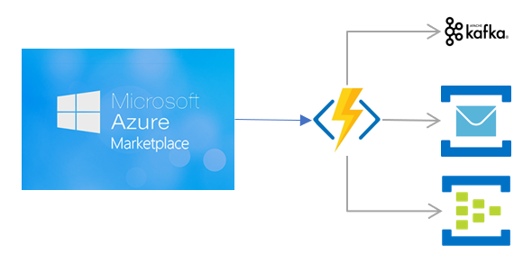

# Azure Marketplace Webhook to Queues

#### develop:
[](https://dev.azure.com/padasil/az-marketplace-webhook-queue/_build/latest?definitionId=16&branchName=develop)

#### master:
[](https://dev.azure.com/padasil/az-marketplace-webhook-queue/_build/latest?definitionId=16&branchName=master)

<div style="text-align:center" >

</div>

This app was created as a middleware to integrate Azure Marketplace Webhooks with diverse queue tecnologies. Through the configuration you can choose which queue technology you want to use from the chart below.

* Supported Queues:
    | Queue              | Status          |
    | ------------------ | --------------  |
    | Service Bus Topics | Implemented     |
    | Service Bus Queues | Not Implemented |
    | EventHubs          | Not Implemented |
    | Kafka              | Not Implemented |

If you need to use one queue that is not implemented yet, please let me know.

## Configuration

All the configuration is done using the appsettings.json (local.settings.json for local development) file or AppSettings inside the Function App configuration on Azure.

### Service Bus Topics

For Service Bus topics, you should fill the following parameters:

#### Values
| Parameter                      | Type   | default            | description                                                                                              |
| ------------------------------ | ------ | ------------------ | -------------------------------------------------------------------------------------------------------- |
| queueType                      | string | `servicebus-topic` | The type of Queue that will be used.                                                                     |
| servicebus.unsubscribeTopic    | string | `unsubscribe`      | The name of the Topic that will receive messages with Action = `Unsubscribe`    |
| servicebus.changePlanTopic     | string | `changePlan`       | The name of the Topic that will receive messages with Action = `ChangePlan`     |
| servicebus.changeQuantityTopic | string | `changeQuantity`   | The name of the Topic that will receive messages with Action = `ChangeQuantity` |
| servicebus.suspendTopic        | string | `suspend`          | The name of the Topic that will receive messages with Action = `Suspend`        |
| servicebus.reinstateTopic      | string | `reinstate`        | The name of the Topic that will receive messages with Action = `Reinstate`      |
| servicebus.informational       | string | `informational`    | The name of the Topic that will receive all other messages that doesn't fit the options above            |

#### Connection Strings
| Parameter  | Type   | default | description                          |
| ---------- | ------ | ------- | ------------------------------------ |
| servicebus | string |         | The type of Queue that will be used. |

#### Example
```
{
    "IsEncrypted": false,
    "Values": {
        "queueType": "servicebus-topic",
        "servicebus": {
            "unsubscribeTopic": "unsubscribe",
            "changePlanTopic": "changeplan",
            "changeQuantityTopic": "changequantity",
            "suspendTopic": "suspend",
            "reinstateTopic": "reinstate",
            "informationalTopic": "informational"
        },
        "FUNCTIONS_WORKER_RUNTIME": "dotnet"
    },
    "ConnectionStrings": {
        "servicebus": "<<your-service-bus-connection-string>>"
    }
}
```